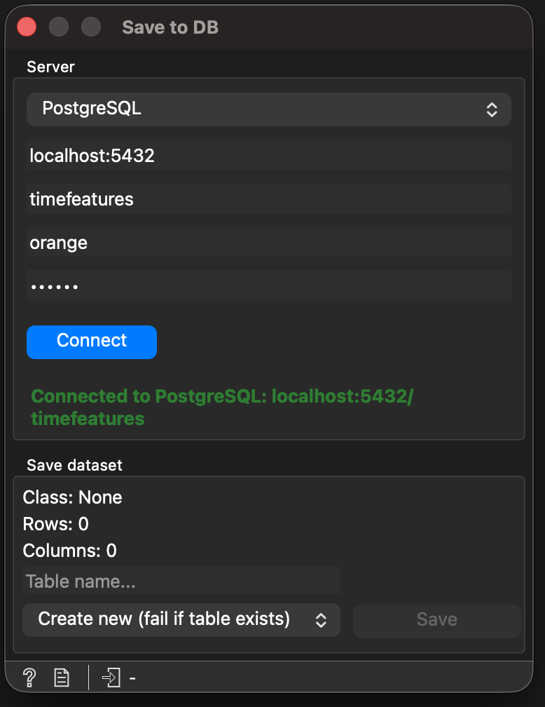

Save to DB
==========

The **Save to DB** widget persists an Orange data table to a SQL
database. Two dialects are supported out of the box:

- **PostgreSQL** — through ``psycopg2``.
- **MySQL** — through ``pymysql``.



   The Save to DB widget.

Both drivers are reached via **SQLAlchemy**, which keeps the SQL
generation, identifier quoting and type rendering dialect-agnostic. The
actual upload uses a `pandas <https://pandas.pydata.org/>`_ DataFrame
and ``DataFrame.to_sql`` with ``method='multi'`` and chunked writes, so
a 100 000-row dataset finishes in seconds even on remote hosts (the
previous row-by-row INSERT would have taken minutes).

Inputs
------

.. list-table::
   :header-rows: 1

   * - Signal
     - Type
     - Description
   * - Data
     - ``Orange.data.Table``
     - The dataset to upload.

Outputs
-------

This widget has no output signals — it is a pipeline sink.

Controls
--------

The widget shows the detected target type, row count and column count
of the input. Connection fields (host, port, database, user, password)
come from Orange's SQL base widget.

TimeFeatures-specific controls:

.. list-table::
   :header-rows: 1

   * - Field
     - Description
   * - Database type
     - Combo box at the top of the connection box. Pick **PostgreSQL**
       or **MySQL**. The connection driver and column types adapt
       automatically.
   * - Connection status
     - Small label under the connection box. Shows three states:
       neutral ("Not connected", "Connecting…", "Uploading rows 3/10…"),
       success ("Connected to PostgreSQL: host/db", "Upload completed
       in 4.2s"), error ("Connection failed: …", "Upload failed: …").
   * - Table name
     - Destination table name. Validated against PostgreSQL identifier
       rules (see *Validation* below); MySQL accepts a superset, so
       the same rule is safe on both.
   * - Mode
     - Combo below the Table name field:

       - **Create new (fail if table exists)** — default, refuses to
         touch an existing table or metadata row. Use this for first
         uploads or when you want a clear error on accidental name
         collisions.
       - **Overwrite (replace existing table)** — uploads the new data
         and only then replaces the existing table and its
         ``datasets`` row. If the upload fails or is cancelled, the
         previous table is kept. Re-running the workflow stops
         breaking.
       - **Append (keep existing rows)** — adds rows to the existing
         table (creating it if it doesn't exist). After the upload,
         the widget runs ``SELECT COUNT(*)`` and rewrites the
         ``datasets`` row with the *actual* total row count, so the
         registry stays accurate across repeated appends.

.. note::

   Completion-email notifications are currently disabled; the Email
   field is hidden until they are re-enabled.

How it Works
------------

When **Save** is clicked, the widget:

1. Validates the table name and the form (host, database).
2. Builds a SQLAlchemy URL from the form fields and the active dialect
   driver (``postgresql+psycopg2://…`` or ``mysql+pymysql://…``).
3. Spawns a background ``QThread`` running an ``_UploadWorker``, so the
   Orange canvas stays responsive even during long uploads.
4. The worker:

   - converts the dataset to a pandas DataFrame with
     ``Orange.data.pandas_compat.table_to_frame(include_metas=True)``
     and reorders the columns (class first, then metas in domain
     order, then attributes) to match the existing schema convention;
   - ensures the ``datasets`` metadata table exists;
   - applies the mode-specific checks: **create** fails fast if a
     ``datasets`` row or a table with this name already exists;
     **overwrite** and **append** leave everything in place;
   - writes the dataset in ``PANDAS_SQL_CHUNKSIZE`` chunks (default
     ``1 000``) via ``df.to_sql(..., method='multi')``. **Append** into
     an existing table writes straight into it. Every other case writes
     into a uniquely named staging table (``_tf_staging_…``);
   - once every chunk is in, swaps the staging table in place of the
     target: ``DROP TABLE`` + ``ALTER TABLE … RENAME`` on PostgreSQL, a
     single multi-table ``RENAME TABLE`` on MySQL;
   - runs ``SELECT COUNT(*)`` on the target table and re-inserts the
     ``datasets`` row with that real row count, so the registry stays
     consistent even after multiple appends.

Everything happens inside a single SQLAlchemy transaction
(``engine.begin()``). On PostgreSQL, DDL is transactional, so a
mid-upload error or a **Cancel** rolls every step back. MySQL
auto-commits DDL (``CREATE TABLE``, ``RENAME TABLE``), which is why the
upload goes through a staging table: until the final swap the target
table is untouched, and on failure the widget drops the staging table
again. Appended rows are ordinary ``INSERT`` statements and are rolled
back on both engines.

.. note::

   If Orange is killed in the middle of an upload to MySQL, the staging
   table cannot be cleaned up and stays behind as ``_tf_staging_…``. It
   never appears in **Load from DB** and can be dropped by hand.

While the worker runs, the widget's progress bar and status label are
updated through Qt signals; the **Save**, **Connect** and form controls
are temporarily disabled. Removing the widget or closing the workflow
during an upload cancels it (rolled back as described above) instead
of freezing the canvas until the upload ends.

Type Mapping
------------

Column types are picked per dialect through SQLAlchemy so the DDL is
correct on either backend. The widget uses the dialect-specific
``DOUBLE_PRECISION`` / ``DOUBLE`` whenever available:

.. list-table::
   :header-rows: 1

   * - Orange Variable
     - PostgreSQL
     - MySQL
   * - ``DiscreteVariable``
     - ``VARCHAR(255)``
     - ``VARCHAR(255)``
   * - ``ContinuousVariable``
     - ``DOUBLE PRECISION``
     - ``DOUBLE``
   * - ``TimeVariable``
     - ``TIMESTAMP``
     - ``DATETIME`` (MySQL's ``TIMESTAMP`` is capped at 2038).
   * - ``StringVariable``
     - ``TEXT``
     - ``TEXT``

Identifiers (table and column names) are quoted by SQLAlchemy with the
dialect's native syntax — ``"name"`` on PostgreSQL,
``\`name\``` on MySQL — and any internal occurrence of the quote
character is doubled to avoid breakouts.

Validation
----------

Before touching the database the widget enforces:

- **Connection established** — a successful **Connect** is required;
  if you click **Save** before connecting, the widget refuses with
  *Connect to a database before saving.*
- **Table name present** — required.
- **Table name well-formed** — must match
  ``^[A-Za-z_][A-Za-z0-9_]{0,62}$`` (PostgreSQL identifier rules:
  starts with a letter or underscore, only letters / digits /
  underscores, max 63 characters). MySQL accepts a superset.
- **Connection fields present** — host and database.

Security
--------

The widget defends against SQL injection at three layers:

- **Parametrised queries** — every value inserted into the database
  goes through SQLAlchemy parameter binding
  (``connection.execute(text(...), params)`` for the metadata row,
  ``DataFrame.to_sql`` for the data). Values are never concatenated
  into the SQL string.
- **Identifier escaping** — table and column identifiers are rendered
  by the SQLAlchemy dialect, which double-escapes the quote character
  per spec (``"`` on PostgreSQL, ``\``` on MySQL).
- **Whitelist on the table name** — the regex above further blocks
  payloads from ever reaching the DDL stage.

Usage Example
-------------

1. Connect a **File** widget (or any data-producing widget) to **Save
   to DB**.
2. Choose **PostgreSQL** or **MySQL** in the Database type combo.
3. Fill in the connection fields (host, database, username, password).
4. Click **Connect**. The status label should turn green with the
   connection details.
5. Enter a valid table name, e.g. ``my_time_series_data``.
6. Click **Save**. Watch the progress bar advance through the chunks
   and the status label switch to *Upload completed in Xs* when done.

Requirements
------------

The widget brings the database drivers and the SQL toolkit:

.. code-block:: text

   SQLAlchemy>=1.4.0       # dialect-agnostic SQL toolkit
   psycopg2-binary>=2.9.9  # PostgreSQL driver
   PyMySQL>=1.0.0          # MySQL driver

``psycopg2-binary`` is the binary distribution, so the widget runs on
macOS, Linux and Windows without a C compiler or the ``libpq``
development headers. ``PyMySQL`` is pure Python and has no native
build step. ``pandas`` itself is already a transitive dependency of
Orange3.
