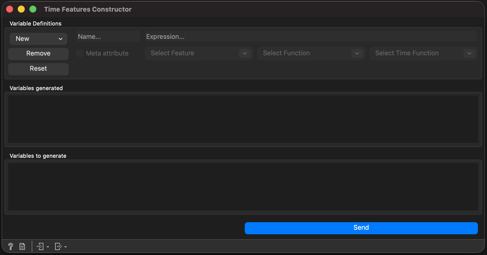

Time Features Constructor
=========================

The **Time Features Constructor** builds new numeric, datetime,
categorical or text variables from existing ones via Python-style
expressions and a family of time-window functions. It is the central
widget for time-series feature engineering inside |addon|.

   The Time Features Constructor widget.

Inputs
------

.. list-table::
   :header-rows: 1

   * - Signal
     - Type
     - Description
   * - Data
     - ``Orange.data.Table``
     - Source table whose columns can be referenced from expressions.
   * - Variable Definitions
     - ``Orange.data.Table``
     - Optional configuration table (``Variable`` / ``Expression``) used
       to *bulk-load* descriptors into the editor.

Outputs
-------

.. list-table::
   :header-rows: 1

   * - Signal
     - Type
     - Description
   * - Data
     - ``Orange.data.Table``
     - The source table extended with the newly generated variables.
   * - Variable Definitions
     - ``Orange.data.Table``
     - A ``Variable`` / ``Expression`` table describing the full output
       domain. Feed this to the **Variable Dependency Graph** widget.

Controls
--------

- **New** — adds a new variable definition to the editor.
- **Remove** — deletes the selected definition.
- **Reset** — clears every definition and rolls the widget state back to
  the original input.
- **Send** — re-evaluates every definition against the input data.

Each editor row exposes a name field, a meta-variable toggle, the
expression field, a source-variable picker, a standard function picker
and a time-function picker.

Expressions
-----------

Expressions are evaluated as restricted Python. Variable references use
the **sanitised** name — spaces and most punctuation are replaced with
underscores, and identifiers that start with a digit receive a leading
underscore.

.. code-block:: python

   age + 1
   log(price)
   shift(age, -20)
   mean(temperature, -2, 2)
   abs(velocity) + sqrt(altitude)

The evaluation environment is locked down: ``__builtins__`` is replaced
with an empty dict so dangerous calls like ``__import__`` or ``open``
fail with ``NameError``. Only the names listed below are exposed.

Available names
~~~~~~~~~~~~~~~

.. list-table::
   :header-rows: 1
   :widths: 25 75

   * - Group
     - Names
   * - Safe builtins
     - ``abs``, ``all``, ``any``, ``bin``, ``bool``, ``bytearray``,
       ``bytes``, ``chr``, ``complex``, ``dict``, ``divmod``,
       ``enumerate``, ``filter``, ``float``, ``format``, ``frozenset``,
       ``getattr``, ``hasattr``, ``hash``, ``hex``, ``id``, ``int``,
       ``iter``, ``len``, ``list``, ``map``, ``max``, ``memoryview``,
       ``min``, ``next``, ``object``, ``oct``, ``ord``, ``pow``,
       ``range``, ``repr``, ``reversed``, ``round``, ``set``, ``slice``,
       ``sorted``, ``str``, ``sum``, ``tuple``, ``type``, ``zip``,
       ``True``, ``False``, ``None``, ``Ellipsis``.
   * - ``math`` module
     - Every public attribute (``sqrt``, ``log``, ``sin``, ``pi``, ``e``,
       ``floor``, ``hypot``, ``atan2``, …).
   * - Random helpers
     - ``normalvariate``, ``gauss``, ``expovariate``, ``gammavariate``,
       ``betavariate``, ``lognormvariate``, ``paretovariate``,
       ``vonmisesvariate``, ``weibullvariate``, ``triangular``,
       ``uniform``.
   * - Aggregators
     - ``mean``, ``std``, ``median``, ``var``, ``cumsum``, ``cumprod``,
       ``argmax``, ``argmin`` and their NaN-aware variants
       (``nanmean``, ``nanstd``, …). All take ``*args`` and delegate to
       NumPy.

Time-window functions
---------------------

These functions operate on the *whole* column rather than the current
row's value, so they need the entire input to be in memory. Out-of-range
indices produce missing values; ``NaN`` entries inside the window are
ignored.

.. list-table::
   :header-rows: 1

   * - Function
     - Semantics
   * - ``shift(var, offset)``
     - Value of ``var`` at the current row plus ``offset``. Returns
       missing when the shifted index falls outside the table.
   * - ``sum(var, start, end)``
     - Sum over the inclusive window ``[row+start, row+end]``,
       skipping ``NaN``.
   * - ``mean(var, start, end)``
     - Arithmetic mean over the window.
   * - ``count(var, start, end)``
     - Number of non-missing values inside the window.
   * - ``min(var, start, end)`` / ``max(var, start, end)``
     - Extreme of the non-missing window values.
   * - ``sd(var, start, end)``
     - Population standard deviation (delegates to ``numpy.std`` with
       ``ddof=0``).

Window semantics across chunks
~~~~~~~~~~~~~~~~~~~~~~~~~~~~~~

Orange chunks tables into 5 000-row blocks when computing derived
columns. The widget caches the **full** column result on first use and
returns the appropriate slice for each chunk, so a call like
``shift(x, -20)`` keeps the right value across chunk boundaries even on
multi-million-row tables.

Chained descriptors
-------------------

Descriptors may reference each other. For example:

.. code-block:: python

   X1 := shift(price, -1)
   X2 := X1 + bias

When this happens, the widget topologically sorts the descriptors by
their dependencies and applies them in cascade — each transform step
runs against the table state produced by the previous step, so ``X2``
sees ``X1`` as if it were a regular source column.

- The order you click **New** in does not matter. Define ``X2`` before
  ``X1`` and the cascade still works.
- Cycles are detected: writing ``X1 := X2 + 1`` together with
  ``X2 := X1 + 1`` raises a *Circular dependency between descriptors:
  X1, X2* error instead of producing garbage.
- Per-descriptor error reporting: if one expression fails (e.g.
  ``shift(unknown, -1)``), the error mentions the descriptor name so
  you know which row to fix.
- Time-window correctness is preserved through the chain: a chained
  ``X2`` that reads ``X1`` over a window keeps producing the right
  values even past Orange's 5 000-row chunk boundary.

Workflow persistence
--------------------

The editor list ("Variables to generate") is the single source of truth.
It is stored as ``Setting(..., schema_only=True)``, mirroring the
upstream Orange Feature Constructor convention introduced in v4. This
means:

- Definitions survive workflow save and reload, even before clicking
  **Send**.
- Each **Send** re-transforms the **original** input, not the previous
  output, so descriptors are not consumed and there is no cumulative
  state to clean up.
- The **Reset** button is the only path that empties the editor.

Usage Example
-------------

A 3-day rolling average for daily ``temperature`` readings:

.. code-block:: python

   mean(temperature, -2, 0)

This computes the mean of the current day plus the two preceding days.
A 5-day forward standard deviation:

.. code-block:: python

   sd(temperature, 1, 5)

Combined features work too:

.. code-block:: python

   (max(price, -7, 0) - min(price, -7, 0)) / mean(price, -7, 0)
